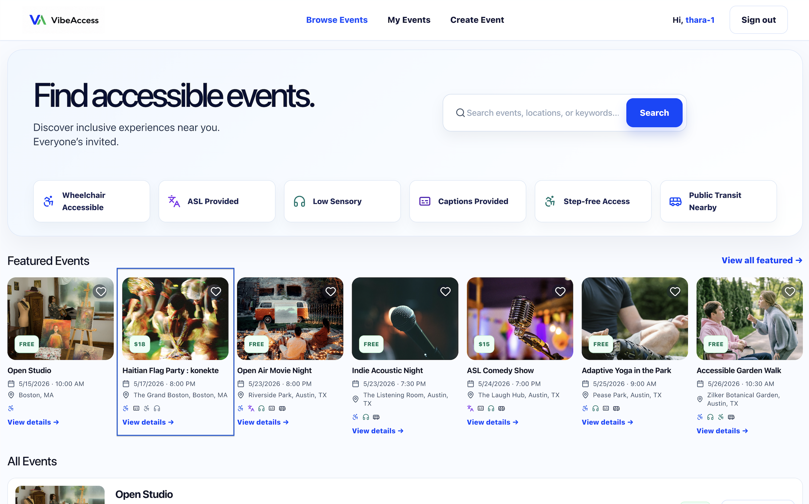
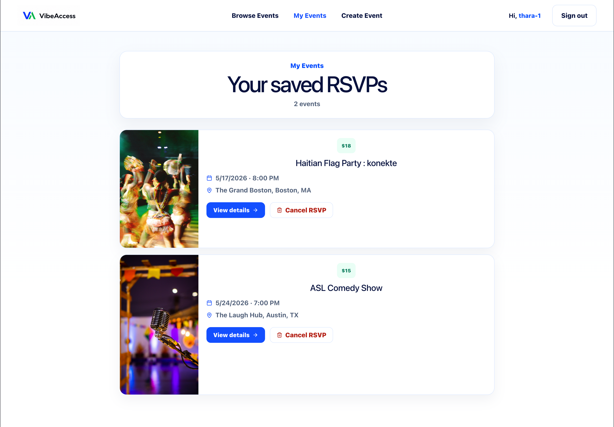
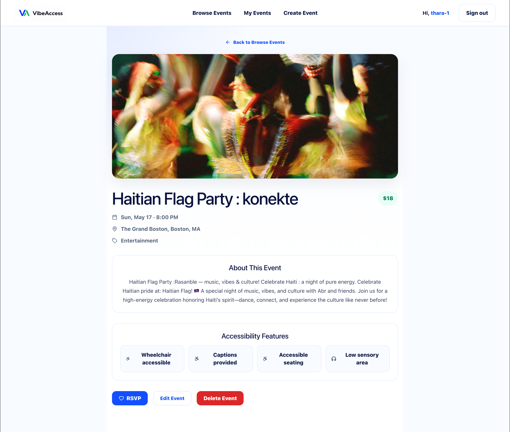

# VibeAccess Front End

VibeAccess is a responsive React web app that helps users discover accessible events and experiences.

This repository contains the front-end code for the VibeAccess MERN stack group project.

---

## Project Overview

The goal of VibeAccess is to create a clean, inclusive, and easy-to-use event discovery experience focused on accessibility and community inclusion.

VibeAccess helps users:

- Browse accessible events
- View event details
- Create and edit events
- RSVP to events
- View their events and RSVPs
- Find events with accessibility features such as:
  - Wheelchair access
  - Captions provided
  - Low sensory environments
  - Step-free entrances
  - Public transit nearby

---

## Screenshots

### Desktop View



### Mobile View



### Event Details



---

## Deployed App

Frontend deployed application:

https://vibe-access-front-end.netlify.app/

---

## Planning Materials

### Trello Board

https://trello.com/b/iqj0RvVq/vibeaccess

---

## Back-End Repository

The back-end repository contains the Express, MongoDB, and authentication logic.

Back-end repository:

https://github.com/cbolze91/vibe-access-back-end

---

## Tech Stack

### Front End

- React
- Vite
- JavaScript
- CSS
- React Router
- Lucide React Icons
- Fetch API

### Development Tools

- Git
- GitHub
- VS Code
- Postman

---

## Key Front-End Concepts

This project practices:

- React components
- Props
- State management
- Routing
- Forms
- Conditional rendering
- API integration
- Authentication
- Protected routes
- CRUD functionality
- Responsive design
- Accessibility-focused UI

---

## Core Features

### Authentication

- User sign up
- User sign in
- User sign out
- JWT token authentication
- Protected routes and authorization

### Event Features

- Browse events
- View event details
- Create events
- Edit events
- Delete events
- RSVP to events
- View RSVPs in My Events

### Accessibility Features

- Accessibility-focused event discovery
- Responsive desktop and mobile layouts
- WCAG-conscious UI structure and contrast
- Accessibility feature tags and indicators

---

## Planned Pages

- Sign Up / Log In
- Browse Events
- Event Details
- Create Event
- Edit Event
- My Events / My RSVPs

---

## How to Run Locally

Clone the repository:

```bash
git clone https://github.com/cbolze91/vibe-access-front-end.git
````

Go into the project folder:

```bash
cd vibe-access-front-end
```

Install dependencies:

```bash
npm install
```

Create a `.env` file in the project root:

```env
VITE_BACK_END_SERVER_URL=http://localhost:3000
```

Start the development server:

```bash
npm run dev
```

Open the local URL shown in the terminal:

```txt
http://localhost:5173/
```

---

## Attributions

* Lucide Icons
  https://lucide.dev/

* Pexels Images
  https://www.pexels.com/

* Unsplash Images
  https://unsplash.com/

---

## Future Enhancements

Potential future improvements include:

* Event categories and sorting
* Saved and favorite events
* Interactive map integration
* Advanced accessibility filtering
* Comment functionality
* Additional deployment and production optimizations

---

## Team

Collaborative full-stack build by:

* Thara Messeroux
* Christina Boles

Focused on accessible event discovery, responsive UI, authentication, and event/RSVP workflows.
